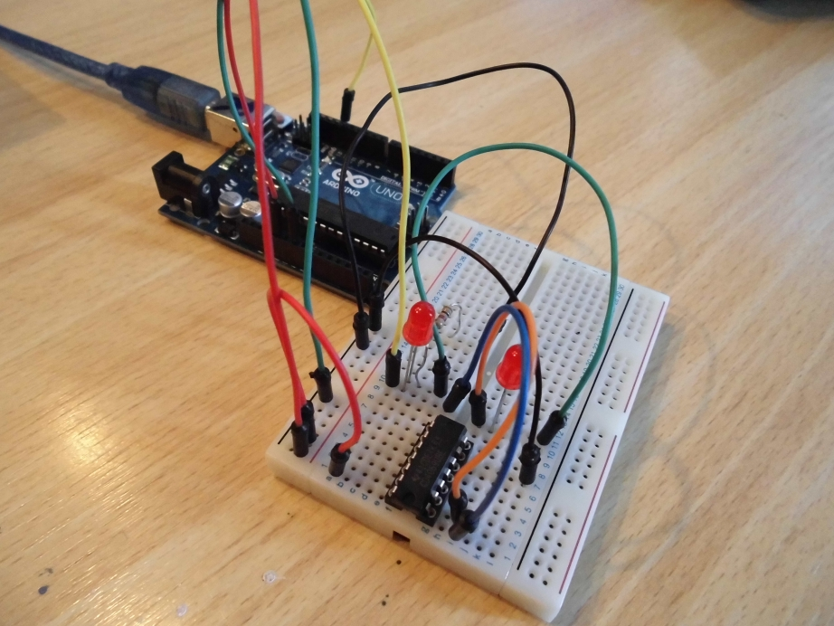
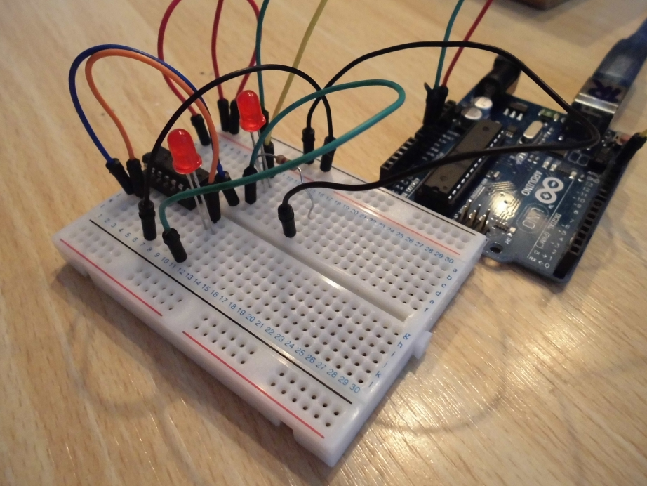
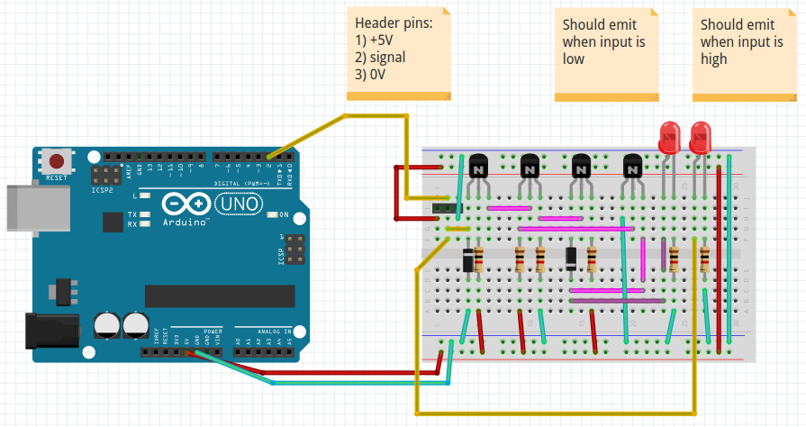

# Inverter

Schematic of an inverter, made in Fritzing.

Contributors (ordered alphabetically on first name):
 * Claudio Tiecher
 * Joke Kort
 * Richel Bilderbeek

Using [an inverter IC](http://www.okaphone.com/artikel.asp?id=433654):

Using transistors and diodes (note: never got this to work), should be the same as using the IC:

